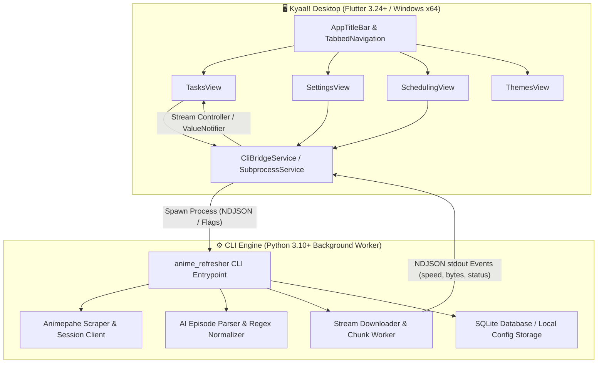
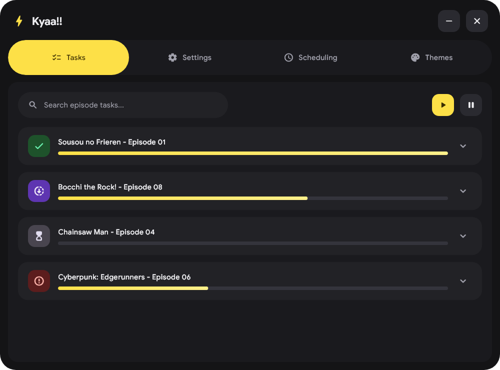
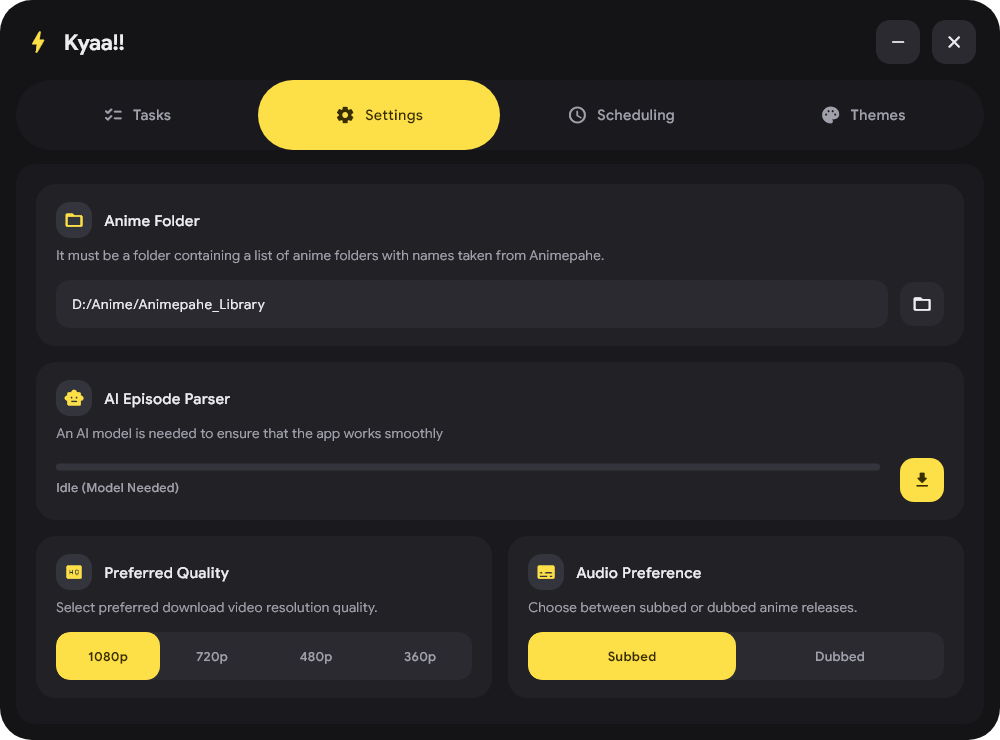
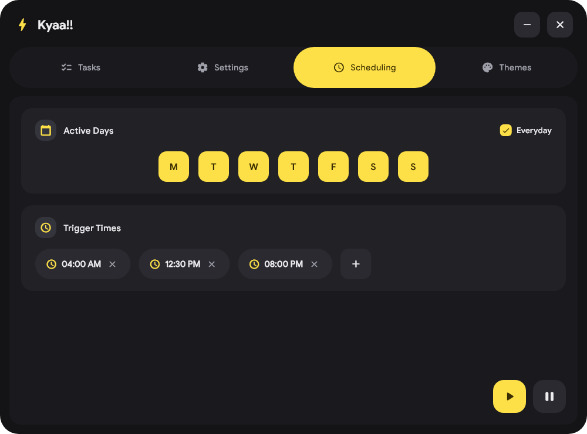
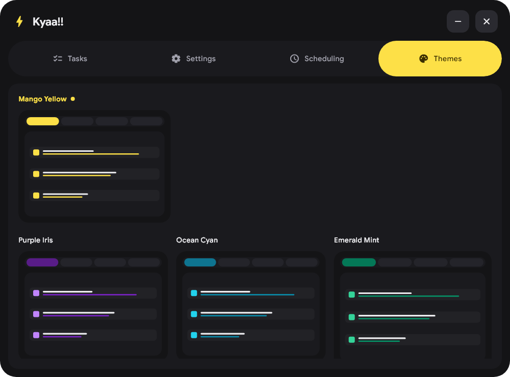

# ✨⚡ Kyaa!! — Automated Anime Library Refresher & Downloader ⚡✨

<div align="center">

[](https://flutter.dev)
[](https://dart.dev)
[](https://python.org)
[](https://opensource.org/licenses/MPL-2.0)
[](https://microsoft.com/windows)
[](https://github.com/AceBurgundy/anime-refresher/releases)

<p align="center">
  <b>A modern, frameless desktop application that automatically monitors your local anime collection, checks Animepahe for newly aired episodes, and downloads high-quality streams straight to your disk.</b>
</p>

[📥 Download Installer](#-installation-guide) • [✨ Key Features](#-key-features) • [🎨 UI Tour](#-ui--visual-tour) • [🚀 Usage Guide](#-usage--step-by-step-workflows) • [⚙️ CLI Architecture](#️-cli-engine-architecture--parameter-reference) • [👤 Author](#-author--maintainer)

</div>

## [Check the Webpage!!](https://kyaa-anime.vercel.app/)

## 📖 Table of Contents

- [🌟 Overview](#-overview)
- [✨ Key Features](#-key-features)
- [🏗️ System Architecture](#️-system-architecture)
- [🎨 UI & Visual Tour](#-ui--visual-tour)
  - [1. 📋 Tasks View](#1--tasks-view)
  - [2. ⚙️ Settings View](#2-️-settings-view)
  - [3. 📅 Scheduling View](#3--scheduling-view)
  - [4. 🎨 Themes View](#4--themes-view)
- [📥 Installation Guide](#-installation-guide)
  - [Option A: Windows Setup Wizard (Recommended)](#option-a-windows-setup-wizard-recommended)
  - [Option B: Standalone Portable Package](#option-b-standalone-portable-package)
  - [Option C: Build from Source](#option-c-build-from-source)
- [🚀 Usage & Step-by-Step Workflows](#-usage--step-by-step-workflows)
  - [Step 1: Configure Your Animepahe Library Directory](#step-1-configure-your-animepahe-library-directory)
  - [Step 2: Initialize the AI Episode Parser](#step-2-initialize-the-ai-episode-parser)
  - [Step 3: Set Preferred Quality & Audio Mode](#step-3-set-preferred-quality--audio-mode)
  - [Step 4: Automate Background Sync Schedules](#step-4-automate-background-sync-schedules)
  - [Step 5: Monitor Live Downloads & View Tracebacks](#step-5-monitor-live-downloads--view-tracebacks)
- [🛠️ CLI Engine Architecture & Parameter Reference](#️-cli-engine-architecture--parameter-reference)
  - [GUI-to-CLI Flag Mapping](#gui-to-cli-flag-mapping)
  - [NDJSON Event Protocol](#ndjson-event-protocol)
- [🎨 Dynamic AMOLED Theme Palette](#-dynamic-amoled-theme-palette)
- [🧪 Testing & Verification](#-testing--verification)
- [🔧 Troubleshooting & FAQ](#-troubleshooting--faq)
- [🤝 Contributing](#-contributing)
- [📄 License](#-license)
- [👤 Author & Maintainer](#-author--maintainer)

## 🌟 Overview

**Kyaa!!** is an intelligent desktop companion designed for anime collectors and enthusiasts. Keeping an unwatched anime library up to date across dozens of currently airing shows is tedious and error-prone. **Kyaa!!** bridges a high-performance Python scraping and episode-parsing engine with a fluent, frameless Flutter GUI.

### 💡 Why Kyaa!!?
- 🚫 **No More Manual Checking:** Automatically discovers new episodes on Animepahe for every show in your folder.
- 🎯 **Accurate Episode Matching:** Uses an integrated local AI model and fallback token regex to accurately parse season numbers, absolute episode numbers, and complex subtitle formats.
- ⚡ **Real-Time NDJSON Streaming:** Features responsive visual feedback with live download speeds, percentage bars, and error logs without polling.
- 💎 **Frameless AMOLED Aesthetics:** Crafted with rounded corners ($32\text{ px}$ radius), smooth hover transitions, squircle micro-interactions, and four vibrant dark themes.

## ✨ Key Features

| Feature | Description |
| | |
| **⚡ Frameless Title Bar** | Custom draggable top window bar with smooth minimize and close window controls. |
| **📊 Real-time Tasks Dashboard** | Searchable task list featuring state badges (*Completed*, *In Progress*, *Queued*, *Failed*), live MB/s bandwidth indicators, and multi-line error inspection. |
| **🤖 AI Episode Parser** | Integrated download manager for the HuggingFace / GGUF episode parsing model ensuring accurate file-to-episode matching. |
| **📁 Flexible Library Management** | Built-in native Windows folder picker to bind your local anime directory seamlessly. |
| **🎛️ Quality & Audio Selectors** | Dynamic preference pills for resolution (**1080p**, **720p**, **480p**, **360p**) and audio tracks (**Subbed**, **Dubbed**). |
| **⏰ Automated Scheduling** | Individual day buttons (*M, T, W, T, F, S, S*), *Everyday* master toggle, and 12-hour time triggers (*e.g., 04:00 AM, 12:30 PM, 08:00 PM*). |
| **🎨 4 AMOLED Themes** | Instantly switch between **Mango Yellow**, **Purple Iris**, **Ocean Cyan**, and **Emerald Mint** with persistent local state. |
| **📦 Zero-Dependency Packaging** | Built-in Windows installer wizard (`Install-Kyaa.ps1` / `Setup.bat` / Inno Setup) with auto-creation of Start Menu and Desktop shortcuts. |

## 🏗️ System Architecture



## 🎨 UI & Visual Tour

### 1. 📋 Tasks View
The **Tasks View** is the primary monitoring cockpit. It provides real-time progress bars, real-time download speeds, byte counters, status chips, and an expandable debug drawer for inspection of failed items.

<div align="center">
  
</div>

- **Instant Search:** Filter tasks by show title or filename in real time.
- **Micro-Animations:** Play and Pause action buttons with hover-shift animations.
- **State Badges:** Color-coded status badges for completed, running, queued, and failed downloads.

### 2. ⚙️ Settings View
The **Settings View** manages local filesystem paths, AI model downloading, and video stream preferences.

<div align="center">
  
</div>

- **Directory Browser:** Integrated Windows folder dialog to choose your Anime library root.
- **Model Downloader:** Live progress bar tracking the initialization of the episode parser.
- **Resolution & Audio Pills:** One-tap selectors for 1080p/720p/480p/360p and Subbed/Dubbed streams.

### 3. 📅 Scheduling View
The **Scheduling View** allows configuring background sync automation so you never miss a newly aired release.

<div align="center">
  
</div>

- **Everyday Toggle & Day Squircles:** Toggle all days at once or isolate specific days (*Monday through Sunday*).
- **12-Hour Trigger Time Pills:** Add multiple trigger times (*e.g., 04:00 AM, 12:30 PM, 08:00 PM*) using a native Material 3 time dialog.

### 4. 🎨 Themes View
The **Themes View** provides four AMOLED-optimized color schemes with live interactive preview cards.

<div align="center">
  
</div>

- **Mango Yellow:** High-contrast, energetic golden highlights.
- **Purple Iris:** Deep neon purple accents.
- **Ocean Cyan:** Cool electric cyan tones.
- **Emerald Mint:** Calming neon mint hues.

## 📥 Installation Guide

### Option A: Windows Setup Wizard (Recommended)

1. Download the latest `KyaaApp_v1.0.0_Windows_Setup.zip` from the [Releases](https://github.com/AceBurgundy/anime-refresher/releases) page.
2. Extract the archive to any folder.
3. Double-click **`Setup.bat`** (or right-click `packaging/Install-Kyaa.ps1` and select *Run with PowerShell*).
4. The installer will:
   - Verify environment dependencies.
   - Install `Kyaa!!` to `%LOCALAPPDATA%\Programs\KyaaApp`.
   - Create a Start Menu shortcut and Desktop icon.
   - Launch `Kyaa!!` automatically.

### Option B: Standalone Portable Package

If you prefer not to install the application system-wide:
1. Download `KyaaApp_v1.0.0_Standalone.zip`.
2. Extract the contents anywhere on your system.
3. Launch **`kyaa_app.exe`** directly.

### Option C: Build from Source

#### Prerequisites
- **Flutter SDK:** $\ge 3.24.0$ ([Install Flutter](https://docs.flutter.dev/get-started/install/windows))
- **Dart SDK:** $\ge 3.5.0$
- **Python:** $\ge 3.10$ with `pip` and `virtualenv`
- **Visual Studio 2022:** With *Desktop development with C++* workload installed

#### Build Steps
```powershell
# 1. Clone the repository
git clone https://github.com/AceBurgundy/kyaa_anime_refresher.git
cd kyaa_anime_refresher

# 2. Install Flutter packages
flutter pub get

# 3. Build release executable for Windows
flutter build windows --release

# 4. Built executable location:
# build/windows/x64/runner/Release/kyaa_app.exe
```

## 🚀 Usage & Step-by-Step Workflows

### Step 1: Configure Your Animepahe Library Directory
1. Open the **Settings** tab.
2. Under **Anime Folder**, click the folder icon to select your local library directory.
   > **Note:** Ensure each subfolder name closely matches the title on [Animepahe](https://animepahe.ru) (*e.g., `Sousou no Frieren`, `Bocchi the Rock!`*).
3. The path is saved immediately to local configuration.

### Step 2: Initialize the AI Episode Parser
1. In the **Settings** tab, locate **AI Episode Parser**.
2. Click **Download Model** to fetch the parsing weights into `assets/models/`.
3. Once completed, the badge will display `Installed & Ready`.

### Step 3: Set Preferred Quality & Audio Mode
1. Choose your desired resolution: `1080p`, `720p`, `480p`, or `360p`.
2. Select your audio format: `Subbed` (default Japanese audio with subtitles) or `Dubbed`.

### Step 4: Automate Background Sync Schedules
1. Switch to the **Scheduling** tab.
2. Select the days you want the synchronizer to trigger.
3. Click the `+` button to add trigger times (*e.g., 08:00 PM*).
4. Click the large **Start Automation** button in the bottom right corner.

### Step 5: Monitor Live Downloads & View Tracebacks
1. Switch to the **Tasks** tab.
2. Click the yellow **Play** button to begin scanning and downloading.
3. Watch live episode progress bars and bandwidth speeds.
4. If an episode fails due to network disruption, click the dropdown arrow to expand detailed stream metadata and click the terminal icon to inspect the exact error traceback.

## 🛠️ CLI Engine Architecture & Parameter Reference

`kyaa_app` communicates directly with its integrated Python backend engine located in `backend/` (or a standalone CLI) as a background worker process.

### GUI-to-CLI Flag Mapping

| GUI Setting / Action | CLI Flag / Argument | Description |
| | | |
| **Anime Folder** | `--library-dir "<path>"` | Root directory containing local anime series subfolders. |
| **Preferred Quality** | `--quality 1080p\|720p\|480p\|360p` | Preferred video stream resolution. |
| **Audio Preference** | `--audio sub\|dub` | Audio track language selection. |
| **Start Tasks** | `--run-now` | Triggers an immediate refresh and download cycle. |
| **NDJSON Output** | `--stream-ndjson` | Formats stdout output as single-line JSON events for GUI ingestion. |
| **Dry Run Mode** | `--dry-run` | Performs scans and checks without downloading video files. |

### NDJSON Event Protocol

During execution, the CLI emits structured JSON events to `stdout`:

```json
{
  "string_event": "download_update",
  "string_timestamp": "2026-09-11T22:45:10Z",
  "string_anime_name": "Sousou no Frieren",
  "int_episode_number": 1,
  "string_filename": "[SubsPlease] Sousou no Frieren - 01 (1080p).mkv",
  "string_download_status": "in-progress",
  "float_progress_percentage": 64.5,
  "int_downloaded_bytes": 915800000,
  "int_total_bytes": 1420000000,
  "float_speed_mbps": 14.8,
  "string_short_error_message": "",
  "string_error_log_message": ""
}
```

## 🎨 Dynamic AMOLED Theme Palette

| Theme | Accent Hex | Background Hex | Surface Container |
| | | | |
| **Mango Yellow** | `#FFE043` | `#0A0A0A` | `#1A1A1A` |
| **Purple Iris** | `#A855F7` | `#0A0A0A` | `#181524` |
| **Ocean Cyan** | `#06B6D4` | `#0A0A0A` | `#121E24` |
| **Emerald Mint** | `#10B981` | `#0A0A0A` | `#12241E` |

## 🧪 Testing & Verification

The test suite includes smoke tests, widget rendering tests, and an automated screenshot generator:

```powershell
# Run all unit and widget tests
flutter test

# Run the automated UI screenshot generator
flutter test test/generate_screenshots_test.dart
```

## 🔧 Troubleshooting & FAQ

<details>
<summary><b>Q: The app opens but doesn't find new episodes.</b></summary>
<p>Ensure that your local anime folder names match the search title on Animepahe. For example, use <code>Bocchi the Rock!</code> instead of <code>BTR_Season1</code>.</p>
</details>

<details>
<summary><b>Q: How do I change the download speed limit?</b></summary>
<p>The CLI uses asynchronous chunk streaming without arbitrary throttling. Ensure your firewall or ISP is not rate-limiting concurrent video chunk requests.</p>
</details>

<details>
<summary><b>Q: Where are configuration files and logs stored?</b></summary>
<p>Configuration settings and SQLite databases are stored in <code>%LOCALAPPDATA%\KyaaApp\config.db</code> and <code>anime_refresher.log</code>.</p>
</details>

## 🤝 Contributing

Contributions, issues, and feature requests are welcome!
1. Fork the Project.
2. Create your Feature Branch (`git checkout -b feature/AmazingFeature`).
3. Commit your Changes (`git commit -m "Add AmazingFeature"`).
4. Push to the Branch (`git push origin feature/AmazingFeature`).
5. Open a Pull Request.

## 📄 License

This project is licensed under the **Mozilla Public License 2.0 (MPL-2.0)**. See the [LICENSE.md](LICENSE.md) file for details.

## 👤 Author & Maintainer

<div align="center">

**Sam Adrian Sabalo**  
*Full Stack Developer & Software Engineer*

[](https://github.com/AceBurgundy)
[](https://sam-sabalo.vercel.app)
[](mailto:samadriansabalo99@gmail.com)

</div>
